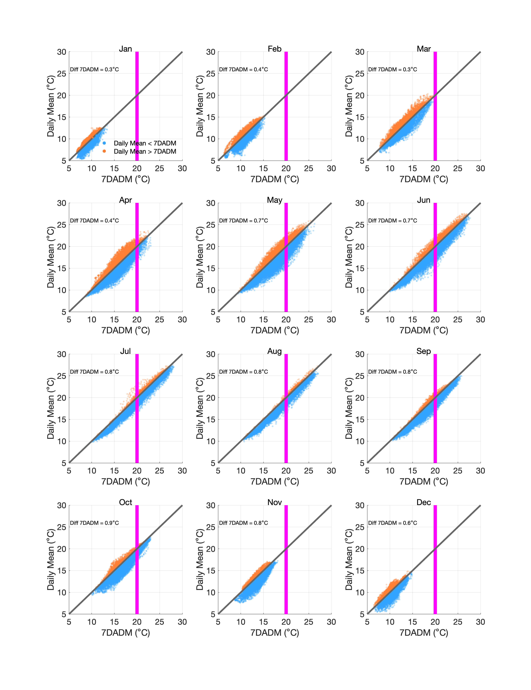
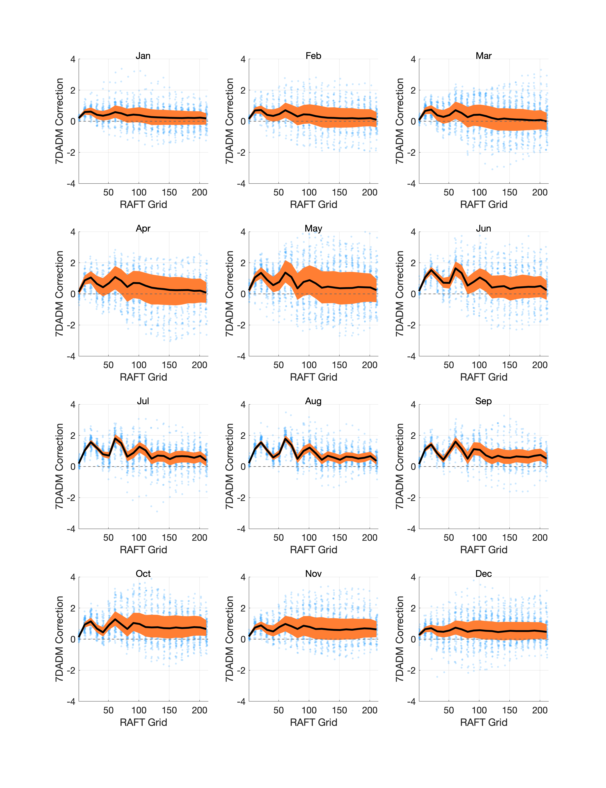
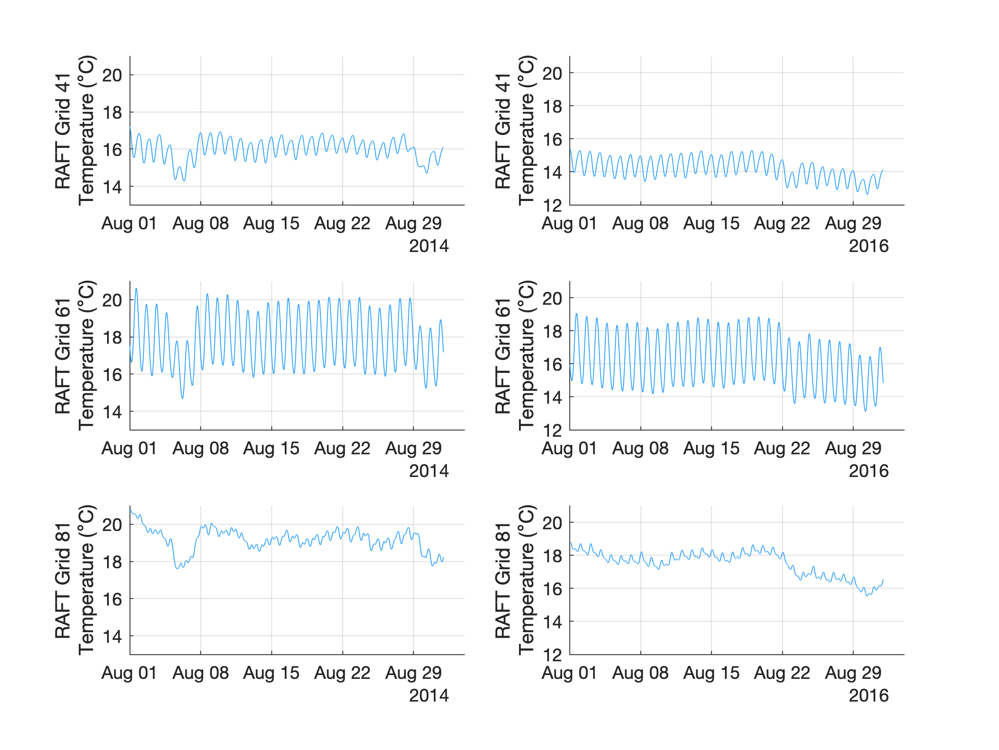

# Mean Daily and 7DADM relation on the Sacramento River, CA 
Last updated 9/13/2024, Miles Daniels (miedanie@ucsc.edu)

This document describes the exploratory analysis of the relationship between 7DADM (7 Day Average of the Daily Maximum) and mean daily (DM) river temperature on the Sacramento River, CA.

### GOAL: The majority of results for the Thermal Thresholds project are presented in temperature units of daily mean. However, most of the regulatory criteria are in units of 7DADM. We would like to have a way to relate results for daily mean to 7DADM. 

### RESULT: It seem that we can relate DM to 7DADM, but that we will need to account for both space and time (probably not a surprise). We could use the file "DA_7DADM_Lookup_9_13_2024.xlsx" to do this by using it as a lookup table for a particular river location and month, or we could take another approach. For more details, see below. 

_Simulations last ran with Matlab version 2023b_

_Note 1: data to perform analysis are at the Google Drive located here: https://drive.google.com/drive/folders/1_q3kOdzp0THbsYTGWtLe9YOcEeWSb341?usp=sharing._

_Note 2: the lookup table that be used used to determine an average adjustment from daily mean to 7DADM is titled "DA_7DADM_Lookup_9_13_2024.xlsx" and can be downloaded from this page._

For this analysis we used hourly temperature data from the RAFT model for the time period of 2000 to 2023. DM was calculated by taking the mean of hourly temperature values for a given day. 7DADM was calculated by taking the average from a time series over 7 days, where the time series was the daily maximum (from hourly data) for day _i_ to day _i-6_.

To have a first look at all the data, below is a scatter plot, where each point is the 7DAMD on the X-axis and the corresponding DM on the Y-axis for each day from 2000-2023 and for each RAFT grids from the upstream boundary at Keswick Dam (Grid 1) to the downstream boundary near Freeport (Grid 214). Points are color-coded, for times where DM is $${\color{#ff7e33}HIGHER}$$ or $${\color{#33a3ff}LOWER}$$ than 7DADM values. From this we can see that DM is not always lower than 7DAMD, but that overall, DM is 0.6C lower than 7DADM.
 

_Figure 1: Scatter plot of 7DADM vs DM for all RAFT grids and days from 2000-2021_

### Does the relationship between DM and 7DAMD vary by time?

From Figure 1 we can see that DM diverges from 7DAMD in a non-constant manner. This may in part be related to time of the year. Specifically, as diel temperature increases, we would expect to see a larger difference between the two metrics. This would indicate that we should include a temporal component when relating results based on DM to 7DAMD. The figure below shows that same data as in Figure 1, but broken out by month. Overall, we can see that DM tends to diverge more from 7DAMD during warmer months as compared to cooler months.

_Figure 2: Scatter plot of 7DADM vs DM for all RAFT grids and days from 2000-2021 stratified by month_

### Does the relationship between DM and 7DAMD vary by space?

Figures 1 and 2 aggregated all values from RAFT grid 0 to 214, but it is likely that the relationship varies over space as well as time. To asses how DM and 7DAMD compare across space and time, Figure 3 below shows results broken out by month and RAFT grid. More specifically, the difference between 7DAMD and DM (7DADM-DM) is plotted for each RAFT grid and over the years (2000-2023) by month. This variability is represented by points and indicates that sometimes the difference between 7DADM and DM is as high as approximately -4 to 4C. From this variability, it is difficult to see a trend, but when plotting the 50th percentile for each RAFT grid (solid black line) and the interquartile range (filled region), we can see a more clear pattern.

_Figure 3: Plot of difference between 7DADM and DM by RAFT grid and month_

Interestingly, we can see that there is often not a monotonic trend in 7DADM-DM, but rather some peaks and valleys. These are more obvious in the upstream reach during summer months and are likely a result of reservoir operations upstream. These locations of more variation and less variation has been demonstrated before on the Sacramento River and have referred to as node and anti-nodes (https://agupubs.onlinelibrary.wiley.com/doi/pdf/10.1029/2000WR900142). To visualize this more clearly, Figure 4 below shows hourly temperature predictions at three locations for two years on the Sacramento River, where variation in river temperature is low, high, and low again respectively. 

_Figure 4: Demonstration of how hourly variability in temperature changes at different locations on the Sacramento River and relates to smaller and larger differences in 7DADM and DM_

### Summary

It seem that we can relate DM to 7DADM, but that we will need to account for both space and time (probably not a surprise). We could use the file titled “DA_7DADM_Lookup_9_13_2024.xlsx” to do this by using it as a lookup table for a particular river location and month, or we could take another approach. # 

### However, applying a correction factor that ignores regional space and time components would lead to biased inferecne. 
